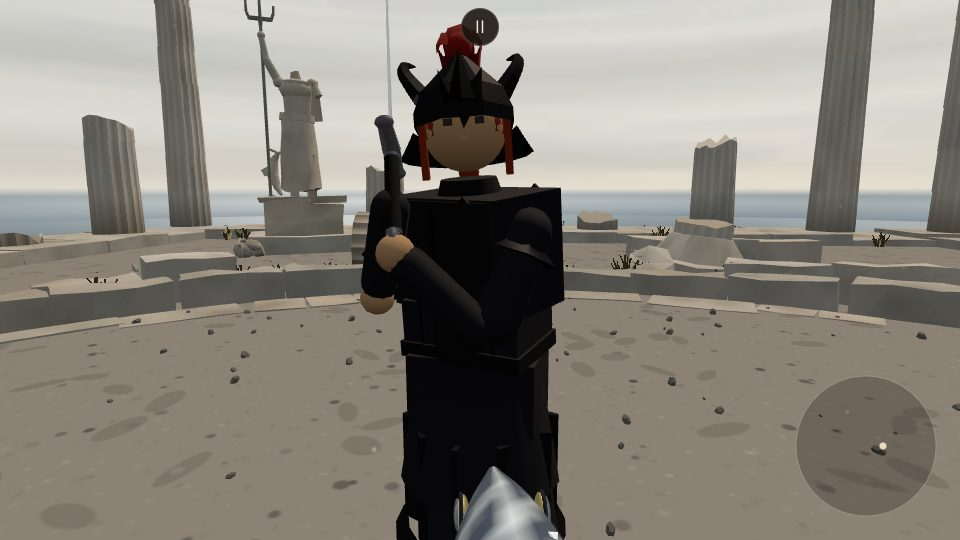
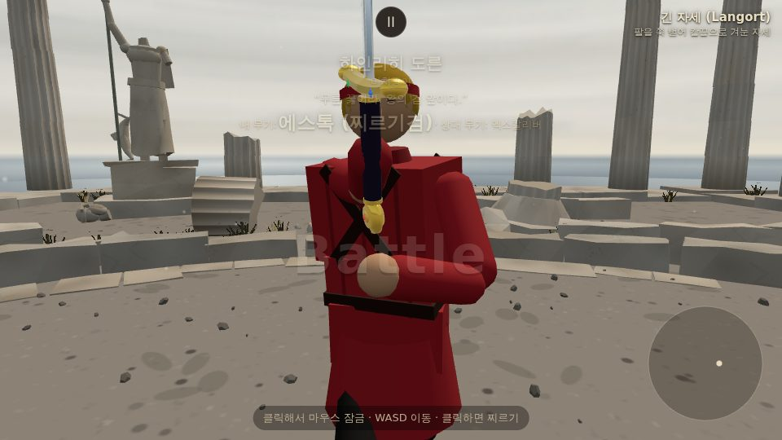
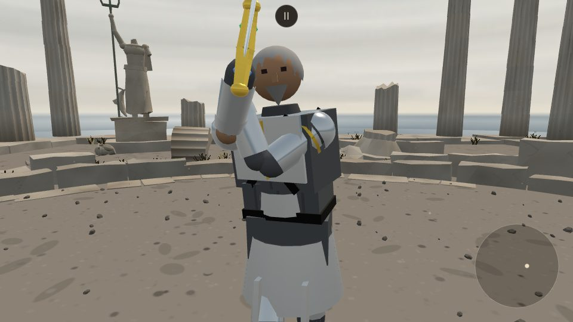
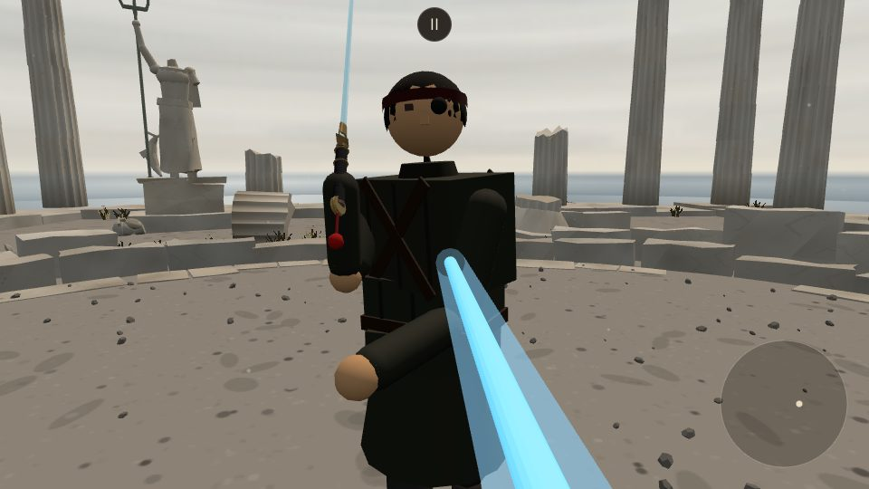
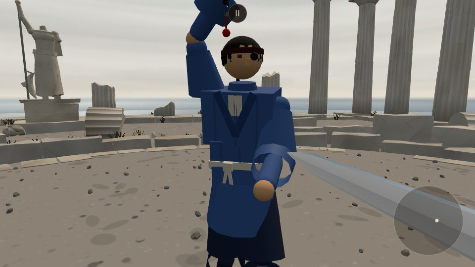
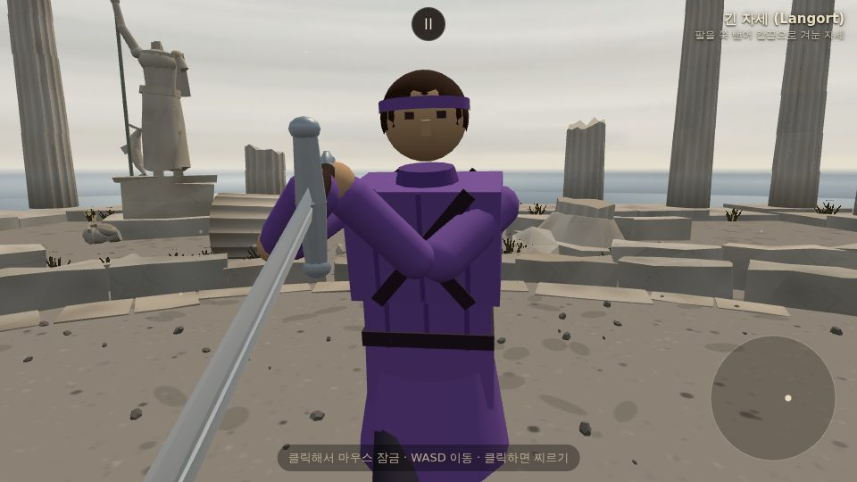
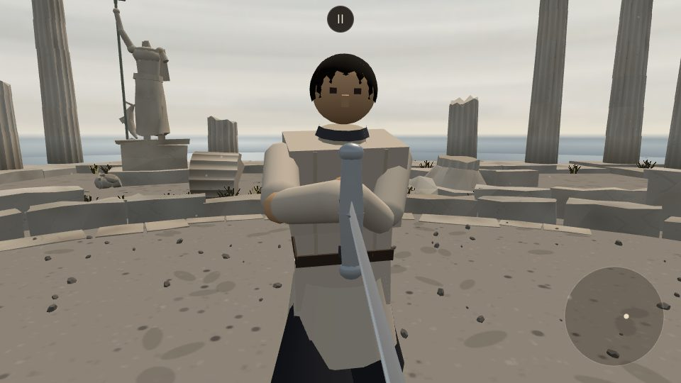
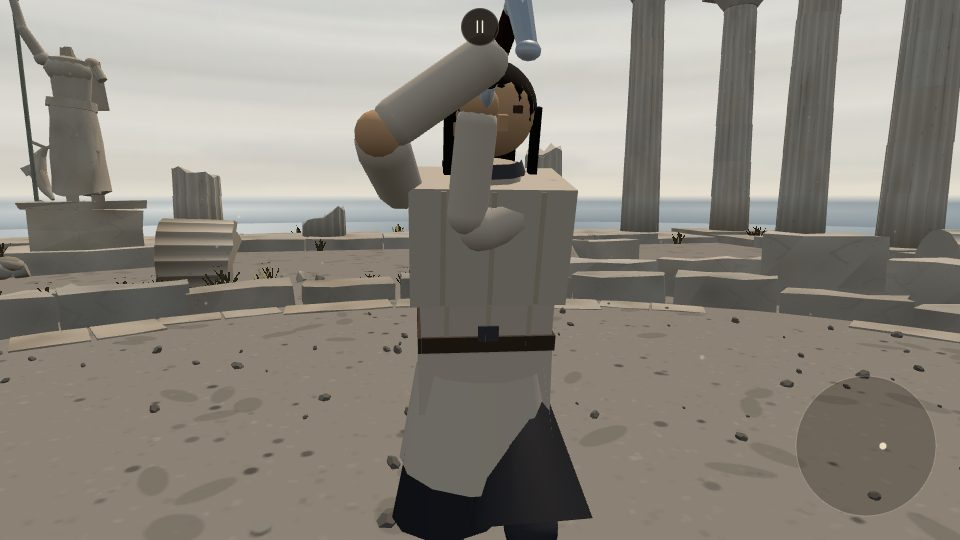

# 캐릭터 겉모습 (모델링 PM 라운드)

오너 요청: "캐릭터 모델링을 개선하고 싶다." 5인의 상대 캐릭터에 갑옷판·머리모양·수염·안대 같은
장식 레이어(`src/outfits.js`)를 새로 얹고, 예전 겉모습은 지우지 않고 `src/looks.js`의
`LOOK_ARCHIVE`에 `v0`로 남겨 두었다. 지금 게임이 쓰는 버전은 `CHARACTER_LOOK_VERSION`이
가리킨다(마르그레테 `v3`, 하인리히 `v2`, 이졸데 `v2`, 랴오 `v5`, 브란만 `v1`). 새 버전을 만들어도 옛 버전은 그대로 둔다.

플레이어(케틀햇+갬비슨)의 겉모습은 요청대로 건드리지 않았다.

**설정집 대조**: 디자인 전에 캐릭터 PM이 쓴 `docs/character_lore.md`·`docs/character_profiles.md`·
`docs/characters.md`(외모 문단)를 읽었다. 오너 요청과 설정집이 겹치지 않는 부분(브란의 낡은
가죽끈, 하인리히의 "화려한 배색", 마르그레테의 "수수하고 차분한 배색"·무장식 칼자루)은 반영했고,
색·실루엣이 정면으로 부딪히는 부분은 **오너 요청을 우선**하되 맨 아래 "설정집 대조" 절에 전부
정리해 캐릭터 PM이 설정집을 고칠 수 있게 했다.

## 파일 분담

캐릭터 PM(`claude/pm-characters`, AI·감정·대사 담당)과 `src/characters.js`를 같이 건드리므로,
그 파일에서는 캐릭터마다 `look:`/`lookVersion:` 두 줄만 바꿨다(다른 줄 재배열·재포맷 없음).
겉모습 데이터는 전부 `src/looks.js`(`LOOK_ARCHIVE`)와 새 파일 `src/outfits.js`에 있다.

## 미리보기

- `?look=<id>:<version>` — 그 캐릭터를 상대로 고정하고 그 버전을 입힌다. 예: `?look=margarethe:v0`
- `?lookv=<version>` — 이번에 고른 상대가 누구든 그 버전을 입힌다(`?foe=`와 함께 써도 된다)
- 버전 이름은 `v0`, `v1`처럼 `v` 접두사를 쓰거나 숫자만(`0`, `1`) 써도 된다

## 마르그레테 슈바르츠 (`margarethe`) — 용기사

**v0(예전)**: 회색 수수한 노장 — 회색 누비옷, 은발.
**v1(보관, `outfit: 'margarethe_dragon'`)**: 먹색(ink-black) 판금 가슴갑옷 + 낮고 두꺼운 쐐기꼴
견갑(용기사 실루엣, 뾰족한 장식이 아니라 방어판처럼), 갈색 머리. 골반의 기존 천 치마 위에 세로
판 10장을 두른 갑주 치마를 얹어 "아래는 치마"인 느낌을 살렸다. 문장·로고·특정 배우를 떠올릴
장식은 넣지 않았다(실루엣·분위기만 참고). **설정집 반영**: 처음엔 와인레드 트림을 넣었는데,
설정집이 그를 "수수하고 차분한 배색", "칼자루에 아무 장식이 없다"고 못 박아서 색 포인트를
빼고 같은 먹색 계열의 짙은/옅은 2톤(이음매만 도드라지게)으로 바꿨다 — 색이 아니라 만듦새로
"빈틈없음"을 낸다.
**v2(보관, `outfit: 'margarethe_dragon_helm'`)**: 오너 요청 "투구를 썼으면 좋겠어, 좀 더 붉은
머리로" — v1 갑옷 그대로에 투구를 씌우고 머리를 적갈색(`0x8a2e1a`)으로 바꿨다.
- 투구: 얼굴이 읽혀야 해서 얼굴을 막지 않는 **코가리개 투구**(nasal helm). 살짝 뾰족한 돔을 앞은
  들고 뒤는 내리게 기울여 이마 테가 눈 위에 걸리고 뒤통수·목덜미(목가리개)를 덮는다. 볏이나
  문장 없이 정수리에 낮은 능선 하나(더 짙은 판)만 — v1의 절제를 그대로 잇는다.
- 붉은 머리: 투구에 대부분 가려지므로 **정면에서는 얼굴 양옆으로 늘어진 옆머리**, **뒤에서는
  목가리개 밑으로 단정하게 땋아 내린 머리 한 가닥**으로 보이게 했다(처음엔 흘러내린 뒷머리를
  뾰족한 판 모양으로 만들었는데 지느러미처럼 보여서 땋은 머리로 바꿨다).
- 순수 장식: `look.helmet`은 `null` 그대로라 `hasHelmet`(머리 방어)이 켜지지 않고, 케틀햇처럼
  세게 맞아 벗겨지지도 않는다. 아래 "오너가 정할 것" 1번 참고.

**v3(지금, `outfit: 'margarethe_dragon_horned'`)**: 오너 요청 "동그랗지 않게 더 장식적인 투구,
삼국지의 마초나 용기사처럼" — 몸·머리색은 v2 그대로 두고 투구만 새로 만들었다.
- 각진 투구: 둥근 돔 대신 **팔각 사발 위에 높은 첨탑**을 세우고 면을 평평하게 칠해(flat shading)
  각이 그대로 보인다. 목가리개도 두 겹 팔각 판으로 벌어진다.
- 마초 계열: 첨탑 끝에서 뒤로 크게 휘어 흘러내리는 **붉은 깃털 술**(머리보다 한 톤 짙은 진홍
  `0x8e1a1a`), 이마 앞에 **세 갈래 볏**(가운데가 높고 양옆은 벌어진다).
- 용기사 계열: 관자놀이 위에서 **먼저 위로 솟았다가 뒤로 젖혀지는 두 뿔**.
- 얼굴은 여전히 열어 둔다 — v2의 코가리개는 빼고 이마 테 가운데에 작은 뾰족 장식만 달았다.
  붉은 옆머리·땋은 머리는 v2와 같다.
- 특정 게임·작품의 투구를 베끼지 않고 "깃털 술·볏·뿔·각진 첨탑"이라는 실루엣 요소만 가져왔다.
- 만들면서 고친 것: 처음엔 뿔·깃털 술을 원기둥 조각을 이어 붙여 만들었는데, 이음매마다 꺾여서
  뿔은 옆으로 뻗은 귀, 술은 붉은 발톱처럼 보였다. 곡선을 따라 굵기가 매끈하게 변하는 관으로 다시
  만들고, 뿔은 위로 솟게, 술은 두툼하고 넓게 바꿨다.
- 여전히 순수 장식(`helmet: null`).
- **곁 판 v1** (2026-09-28, 디렉터 지시·사장님 승인): 판금이 실제로 막고 두 단계로 깨지게 되면서(config.js ARMOR), 1단계(내구 0.9
  아래)에 떨어지는 조각이 가슴 이음매 줄(24×1×0.8cm, 먹색 위 먹색)뿐이라 대결 거리에서 깨지는 게 안 보였다. 막는 힘·판정은 그대로
  두고 겉모습만: **가슴판 위·아래 가장자리에 밝은 강철 테**(27×2×35cm, 27×2.4×35cm)와 **배 판 아래 겹판 한 장**(28×3.4×28cm,
  본판의 0.32배)을 덧댔다. 색은 밝은 강철(`0x8d939b`) 하나 — 먹색 2톤에 셋째 톤을 더한 것뿐, 튀는 색은 없다. 이음매 줄은 남겼다.
  v3 세트(`MARGARETHE_DRAGON_HORNED`)의 chest·abdomen 만 덮어써서 v1·v2 보관본은 그대로다.
  비교: [margarethe_trim_v1.png](handoff/margarethe_trim_v1.png). 떨어지는 순간: [전](character_looks/margarethe_trim_before.png) ·
  [순간](character_looks/margarethe_trim_moment.png) · [후](character_looks/margarethe_trim_after.png).

| v0 | v1 | v2 | v3 (지금) |
| --- | --- | --- | --- |
|  |  |  |  |

v3 투구 근접: [정면](character_looks/margarethe_v3_head_front.jpg) ·
[옆(깃털 술)](character_looks/margarethe_v3_head_side.jpg) · [뒤](character_looks/margarethe_v3_head_back.jpg)

v2 투구 근접: [정면](character_looks/margarethe_v2_head_front.jpg) ·
[뒤(땋은 머리)](character_looks/margarethe_v2_head_back.jpg)

v3 추가 컷: [3/4](character_looks/margarethe_threeq.jpg) · [옆](character_looks/margarethe_side.jpg) ·
[기본 대결 화면](character_looks/margarethe_default.jpg) · [쓰러짐](character_looks/margarethe_down.jpg)
(쓰러져도 투구·깃털 술·땋은 머리가 머리를 따라간다). 옛 버전은 `?look=margarethe:v1`,
`?look=margarethe:v2`로 언제든 다시 볼 수 있다.

## 권총 겉모습 효과 (`src/gun_fx.js`, 사장님 결정: "총구 섬광·연기 필요", "방식 B로 총알 궤적", "레이저는 아주 희미하게")

무기 PM의 권총(`src/gun.js`, ??? 등급)은 소리만 있고 불꽃·연기가 없었다. 외형 PM이 겉모습만 얹었다 — 판정·난수 무관. 전부 `gun_fx.js` 한 파일, 갈고리 하나(`GUN_HOOKS.onShot`)로만 잇는다.
- **섬광**: 총구에 additive 스프라이트 두 장(네 갈래 별 + 뜨거운 심)이 0.075초(네댓 프레임) 번쩍이며 커졌다 사라진다.
- **연기**: 회색 점 24개가 총신 방향으로 뿜어져 느려지며 위로 떠오르고 1.2초 안에 사라진다. 퍼짐은 정해진 표(황금각)라 난수가 없다. 흰 눈밭 앞에서는 옅게, 밤에는 또렷하게 보인다.
- **총알 궤적 (방식 B)**: 총구에서 총알이 닿은 곳까지 옅은 담황색 줄 하나(1 cm, 불투명도 0.42→0)가 0.11초 보였다 사라진다 — 빗나갔는지 한눈에 읽힌다. 더하기 섞기는 눈밭 앞에서 아예 안 보여서 보통 섞기다. 실제 총알 방향(퍼짐·AI 보정이 든 것)과 닿은 거리는 무기 PM이 `onShot(f, p, dir, dist)`로 넘기고, 안 넘어오면 총신 방향으로 그리고 거리는 같은 광선으로 잰다.
- **조준 레이저**: 사장님 "조준이 가능하려면 미리 발사궤적을 따라 옅은 레이저 선이 보여야", "아주 미세해야 해… 희미하게". 총을 든 검객마다 총구에서 총신 방향으로 처음 닿는 곳까지 붉은 선(5 mm, 불투명도 0.13)과 닿은 자리의 작은 점(1.2 cm, 0.3). 장전 중에도 같다 — **장전 표시는 하지 않는다**(사장님: "장전 표시는 과하다"; 앞서 정했던 실린더 회전·스윙아웃은 취소). 겉모습은 여기서만 정하고, gun.js 의 자체 레이저(`GUN.laser`)는 무기 PM이 끈다(두 겹 방지).
- **이음새**: `gun.js` 의 `GUN_HOOKS.onShot` 을 감싼다(원래 걸린 소리는 그대로, 없으면 `gunshotSound` 를 직접 낸다). 스스로 돈다(requestAnimationFrame, 일시정지 중 멈춤). **main.js 두 줄** `installGunFx({ scene, sound, world, combat })` 과 판 바뀜 자리(clearDebris 옆)의 `clearGunFx()` 를 디렉터가 넣는다. world·combat 은 레이저·궤적 끝을 재는 읽기 전용 광선에만 쓴다. 디렉터 결정: 총은 현대식 리볼버(무기 PM이 다시 그림). 사격 자세는 온몸 타격 작업 뒤 디렉터가 정한다(지금 손대지 않음). 권총은 카드로만 나오므로 권총집 장식은 없다.
- 효과 두 벌을 미리 만들어 돌려쓴다(두 검객이 거의 동시에 쏠 때). 레이저는 총 든 검객 수만큼. 조명은 만들지 않는다.
- **v2 (사장님 9/29 "리볼버 발사 이펙트가 지금 좀 약한 거 같애" → 디렉터 지시)**: 섬광을 더 크고 밝게(별 0.6→1.1 m, 0.04초 최대 뒤 0.11초까지 빠른 감쇠) + 총구 앞 짧은 화염(원뿔 두 겹: 보통 섞기 속불 + 더하기 겉불, 세로 그라데이션으로 혀 모양, 0.24→0.4 m). 화약 불티 14점(밝은 주황, 보통 섞기, 중력, 0.35초). 연기 36점·더 크고 짙게. 궤적 줄 1.6 cm·불투명도 0.75·0.16초. 발사 순간 화면 흔들림(main.js `kickCamera` 를 `shake` 로 받음: 자기 총 0.45, 상대 총 0.15 — 맞았을 때 1.4 보다 작게). 총구 점광 하나(0xffb060, 세기 7→0, 0.1초, 거리 5 m) — 처음부터 장면에 두고 세기만 바꿔 셰이더 재컴파일 없음. 낮 무대 대비는 보통 섞기의 속불·불티·궤적이 맡는다. 전후 비교: [밤](handoff/gun_fx_v2_night.png) · [낮](handoff/gun_fx_v2_day.png) · [연기(0.7초 뒤)](handoff/gun_fx_v2_smoke.png). main.js 한 줄: installGunFx 호출에 `shake: (dir, strength) => kickCamera(dir, strength)`.
- **v3 폰 성능 후속 (디렉터)**: (1) 첫 발 멈칫 — `warmGunFx(renderer, camera)` 가 효과 물체를 임시 장면에 옮겨 지금 무대의 빛·안개로 컴파일하고(`compile(tmp, camera, scene)`), 질감을 올리고, 다음 두 프레임을 불투명도 0 으로 그려 꼭짓점 버퍼까지 올린다. main.js 가 권총이 있는 판을 세울 때 부른다. (2) 총구 점광을 없애고 총구 둘레 큰 더하기 빛무리(지름 약 3 m, 0.1초)로 바꿨다 — 점광을 늘 두면 빛 받는 모든 재질이 매 픽셀 빛 하나를 더 계산하고, 쏠 때만 넣었다 빼면 빛 개수가 바뀌어 모든 재질 셰이더가 다시 만들어진다(측정: 성 안뜰 프로그램 19 → 33). 수치(헤드리스, 프레임 중앙값 대비):

| | v2 첫 발 | v3 첫 발 |
| --- | --- | --- |
| 새 셰이더 프로그램 | 4개 | 0개 |
| 새 모양·질감 올림 | 8·3 | 0·0 |
| 첫 발 프레임 (성 안뜰, 평소 약 130 ms) | 415~570 ms | 131 ms |
| 첫 발 프레임 (밤 신전, 평소 약 165~240 ms) | 491~726 ms | 213~304 ms (둘째 발과 같은 폭) |

점광 유무의 평소 프레임 차이는 헤드리스(소프트웨어 렌더)에서 ±3% 잡음 안이라 가려지지 않았다 — 폰에서는 조명 계산이 더 비싸므로 없애는 쪽을 골랐다. 사진: [밤](handoff/gun_fx_v3_night.png) · [낮](handoff/gun_fx_v3_day.png).
- 스크린샷: [궤적(성 안뜰)](handoff/gun_fx_trace.png) · [궤적(밤 신전)](handoff/gun_fx_trace_night.png) · [레이저(성 안뜰)](handoff/gun_fx_laser.png) · [레이저(밤 신전)](handoff/gun_fx_laser_night.png) · [섬광(밤 신전)](handoff/gun_fx_flash.png) · [연기](handoff/gun_fx_smoke.png) · [섬광(성 안뜰)](handoff/gun_fx_flash_castle.png)

## 칼 잔상 띠 (`src/sword_trail.js`, 디렉터 R0 화면 신호)

디렉터(2026-09-29): "최근 물리 자세 2~4개의 칼 선분(칼자루→칼끝)으로 만든 삼각형 띠. 더하기 섞기, 약 60 ms에 사라짐, 빠를수록 짙음(칼끝 8 m/s 부터 25 m/s 최대, 값은 CONFIG), 그리기 호출 1번, 스텝당 0.1 ms 미만. 컨셉 '적막' 유지. 리볼버에는 안 붙임."
- 물리 스텝마다 두 검객의 칼자루·칼끝 점을 고리(4개)에 기록하고, 프레임마다 자세 사이를 사각형(삼각형 둘)으로 잇는다. 두 검객 띠가 한 BufferGeometry 라 그리기 호출 1번. 색은 꼭짓점 색(검정 = 안 보임)으로 나이·속도를 담는다.
- `CONFIG.SWORD_TRAIL` = { samples 4, life 0.06 s, vMin 8, vMax 25 m/s, strength 0.4, hiltFade 0.3 }. 찬 강철빛(`0xd2dff0`), 칼자루 쪽은 0.3 배로 옅어 칼끝 줄기로 읽힌다. strength 0.55 는 밤에 흰 부채꼴로 보여 0.4 로 낮췄다.
- `setTone('normal'|'gold'|'grey')` — 금색(멈출 수 없는 구간)·회색(복귀 중)은 디렉터가 R4 에서 부른다. 부러진 칼은 `bladePoint` 가 남은 길이를 쓰므로 토막만큼만. 리볼버·놓친 칼은 건너뛴다.
- 비용: `sample()` 스텝당 0.002~0.004 ms, `update()` 0.001~0.003 ms (헤드리스). 더하기 섞기라 눈밭·밝은 하늘 앞에서는 옅고 어두운 벽·밤에 또렷하다(디렉터 지정 방식).
- 관문: fights12·hybrid fights12·live_battery main 940f665 과 바이트 동일, 스모크 콘솔 에러 0. 사진: [베기 중(밤)](handoff/sword_trail_cut.png) · [확대](handoff/sword_trail_cut_zoom.png) · [베기 중(낮)](handoff/sword_trail_cut_day.png) · [정지 시](handoff/sword_trail_rest.png).

### 칼 잔상 띠 v2 (사장님 9/30 "칼무리의 궤적이 너무 반짝여서 오히려 칼보다 돋보이는 거 같애. 나뭇가지나 낮은 계급 칼을 들면 어울리지도 않고")
- 더하기 섞기를 버리고 **보통 섞기의 반투명 띠**. 색은 그 칼날 재질 색 × `dim` 0.55 — 늘 칼보다 어둡고, 밤에 흰 부채꼴이 되지 않으며 안개도 받는다. 청강검은 제 칼날 색조(청록 회색)를 따른다. 불투명도 최대 `strength` 0.3(속도 25 m/s), 칼자루 쪽 0.3 배.
- **무기별**: `trailFor(weapon)` = 금속 칼날(`material 'steel'`)이면서 `tier` 가 `trash` 가 아닐 때만. 나뭇가지(wood·trash)·고무닭(rubber)·냉동참치(frozen)·광선검(plasma, 자체 빛)·리볼버(gun)는 잔상 없음. weapons.js 의 기존 필드(material·tier·gun)만 읽어 새 필드는 필요 없었다.
- 금색·회색 톤(`setTone`)은 짧고 은은한 어두운 금색·회색으로만 남겼다(R5 에서 다른 자리로 옮긴다).
- 확인(헤드리스 12초): 롱소드·청강검은 띠가 그려지고(색 0.38·0.40·0.42 / 0.30·0.39·0.41), 나뭇가지·광선검·고무닭은 한 번도 안 그려진다. 전후 비교: [강철](handoff/sword_trail_v2_steel.png) · [나뭇가지](handoff/sword_trail_v2_branch.png).

## 참수 겉모습 (`src/decap_fx.js`, 사장님 9/30 "머리를 베게 되면 머리가 떨어지면 좋겠는데" — 물리·판정은 디렉터 `fighter.decapitate`)
- **목 단면**: 몸통 쪽(가슴 그룹, 목 단면 상처 `stump` 의 local 자리, 옷깃 위 y ≥ 0.176)과 머리 쪽(머리 그룹 y −0.072, 아래를 봄)에 반지름 4.6 cm 원판 — 검붉은 살(`0x4a0a0c`) + 조금 밝은 가장자리 띠 + 뒤쪽으로 치우친 작은 목뼈 단면(`0xcfc4b2`). '피 표현'을 끄면 어두운 회색.
- **피 분출**: 몸통 단면에서 처음 1.5초, 목 방향으로 박동(2.2 Hz)하며 초당 70 → 10 방울, 속도 4 → 1.4 m/s. 그 뒤는 기존 상처 출혈(stump 상처의 bleed → `updateDrips`)이 이어받는다. 머리 쪽은 처음 0.8초 몇 방울. '피 표현'을 끄면 분출 없음. 이 모듈 전용 난수(순번 해시) — `Math.random` 안 씀.
- **떨어진 머리**: 광기의 하인리히 안광은 머리 그룹의 자식이라 머리와 같이 떨어지고, 죽은 뒤 2.5초에 꺼진다 — 땅에 구른 머리에 떠 있는 눈빛은 없다. 투구·머리카락도 머리와 함께 간다(디렉터 물리).
- main.js 세 줄: import, `createDecapFx(particles)`, 프레임마다 `decapFx.update([player, enemy], dt * scale)`.
- 관문: fights12·hybrid fights12·live_battery main 과 바이트 동일, smoke 콘솔 에러 0, `decap_shots.mjs`(liao 성 안뜰, heinrich_mad 밤 신전) 참수 확인 통과·콘솔 에러 0. 전후: [decap_fx_v1.png](handoff/decap_fx_v1.png).
- 메모(디렉터 몫): 기본 카메라에서는 결과 글자 "승리"가 화면 가운데를 덮어 슬로모션 중 머리 분리가 글자 뒤에 가려질 때가 있다. 옆 카메라에서는 분리가 잘 읽힌다.

## 광기의 하인리히 — 붉은 안광 (`src/mad_eyes.js`, 사장님 요청 · 디렉터 나눔)

사장님(2026-09-28): "밤의 포세이돈 신전에 등장하는 하인리히 앞에 '광기의'라는 접두를 붙여서 다른 캐릭터로 구분하고 싶어. 모델링은 그대로 쓰되 광기를 표현하고 싶어. 눈을 붉게 할까? 안광이 아우라처럼 흔들리게."
캐릭터 항목은 캐릭터 PM 몫(`eyes: 'madGlow'` 가 표식). 외형 PM은 안광만 — 모델링은 그대로.
- **눈**: 두 눈 자리(기본 얼굴의 검은 눈 상자 바로 앞)에 눈보다 조금 큰 빛무리 두 겹 — 보통 섞기의 심(작은 밝은 점 → 진홍 → 검붉은 가장자리, 5 cm. 사장님 확인 뒤 "더 진한 핏빛으로": v1의 흰빛·노랑 중심을 뺐다. 이어 "할로겐 라이트·전구 같다, 밝기를 조금만 줄이자": 심 불투명도 0.55+0.6fl → 0.42+0.5fl, 무리 0.75 → 0.5·크기 0.16 → 0.135 m, 가운데 점도 더 어둡게)은 낮 무대·눈밭·픽셀 모드에서도 붉은 점으로 읽히고, 더하기 섞기의 무리(16 cm)는 밤에 번진다. 머리 그룹의 자식이라 머리와 같이 움직인다.
- **흔들림**: 규칙적 깜빡임이 아니라 촛불처럼 — 서로 안 맞는 진동 셋(7.3·13.1·23.7 Hz 근처)과 해시 잡음을 섞어 밝기·크기가 함께 조금씩 일렁인다. 두 눈은 위상이 다르다. 시간 함수라 난수 없음.
- **빛꼬리**: 눈 자리의 속도(세계 좌표 변화, 고개 돌림 포함)가 0.8 m/s 를 넘으면 눈이 지나온 쪽으로 붉은 잔상 여섯 장을 0.16초 분량 늘어놓는다(뒤로 갈수록 옅고 작게). 2.4 m/s 에서 가장 진하다. 속도로 늘어놓아 프레임 속도와 무관하게 같은 길이. 《베르세르크》 광전사 갑옷·《세키로》 붉은 눈의 분위기만 참고.
- **얼굴 둘레**: 아주 옅은 붉은 빛 한 장(불투명도 0.055, 더하기 섞기) — 밤에만 은근히. 더 세게 하면 은발·투구까지 붉게 물들어 맨머리처럼 보였다. 몸 전체 오라는 없음("적막하고 고독한 대결").
- **죽으면** 2.5초에 걸쳐 심까지 완전히 꺼진다. **판이 바뀌면** main.js 의 auras 목록과 같이 dispose() 로 치운다(잔상은 장면에 두므로 fighterMeshes 뒤에 붙인다).
- 비용: 스프라이트 17장(눈 2×2 + 잔상 2×6 + 얼굴 1), 텍스처 2장(64×64), 조명 없음. 판정·물리 무관 — 시뮬 3종 main 과 바이트 동일(mad_eyes 는 main.js 만 부른다).
- main.js: import 한 줄 + `attachMadEyes(enemy, currentFoe?.eyes === 'madGlow' || params.has('madEyes'))` 를 auras 에 넣는 두 줄. 시험 스위치 `?foe=heinrich&madEyes=1`.
- 비교 이미지: [mad_eyes_v1.png](handoff/mad_eyes_v1.png) (밤 신전 서 있을 때·휘두를 때·확대·가까운 얼굴·낮 무대·픽셀 모드·안광 없는 지금 모습) · [얼굴](handoff/mad_eyes_face.png) · [빛꼬리](handoff/mad_eyes_swing.png)

## 판금 밑의 누비 속옷 (마르그레테·하인리히 공통)

오너(2026-09-28): "갑옷 파괴 시 겹판이 표시되는 그래픽으론 모자란 거 같아. 갑옷 안에 덧대입는 흰색 천 옷이 보여야 해. 좀 너덜너덜한 느낌으로."
- 판금이 **완전히 부서져 사라지면** 그 자리에 흰 누비 속옷이 드러난다(`outfits.js underCloth`, `setPlateWear`가 내구 0에 켠다). 멀쩡할 때는 숨겨 두어 겉모습은 전과 같다.
- 가슴: 판보다 조금 작은 흰 조끼(가로 누빔 줄 다섯), 앞가슴에 비스듬히 찢긴 틈 둘(밑의 검은 옷이 보인다), 아랫단에 찢겨 늘어진 조각 일곱(길이·기울기 제각각, 둘은 땀·때가 밴 색). 배: 흰 띠와 찢긴 자락 다섯.
- 흰 무명 `0xf1ece0`, 누빔 줄 `0xcbc2ae`, 때 밴 조각 `0xb4aa97`. 그늘진 앞면도 흰 천으로 읽히게 아주 약하게 스스로 빛난다(emissive `0x2b2824`).
- 난수 없이 정해진 자리라 시드 시뮬은 그대로다: ARMOR 끔 fights12·hybrid fights12·live_battery, armor_eval probe 가 main 과 바이트 동일. 캐릭터를 만들 때 미리 만든다.
- 두 세트(`HEINRICH_KNIGHT`·`MARGARETHE_DRAGON`)에 같은 도우미를 달아 두 판금 검객 모두, 보관본 버전도 같다(부서질 때만 보이므로 멀쩡한 모습은 그대로).
- 스크린샷(판을 상처 없이 직접 부순 뒤): [마르그레테 앞](character_looks/margarethe_under_broken.png) · [옆](character_looks/margarethe_under_broken_side.png) · [하인리히](character_looks/heinrich_under_broken.png)

## 하인리히 도른 (`heinrich`) — 은빛 중갑 기사

**v0(예전)**: 붉은 금장 흥행 검객 — 빨간 더블릿, 금발.
**v1(보관, `outfit: 'heinrich_knight'`)**: 은빛(bright silver) 판금 가슴갑옷·배갑옷·허벅지
자락(tasset)·정강이받이(그리브)·손목 보호대(가운틀릿 커프)·둥근 견갑, 은발 + 짧은 은수염.
투구는 얹지 않았다(오너 요청에 투구 언급 없음, `hasHelmet` 관련 절 참고). **설정집 반영**:
설정집은 그를 "화려한 배색"의 자칭 왕의 기사로 쓴다 — 은빛으로 바뀌어도 그 허영은 남겨야 해서,
갑옷을 실전 갑옷보다 훨씬 반들반들하게(금속성 0.85·거칠기 0.16) 닦고, 예전 금빛 복제
엑스칼리버·금장 취향을 잇는 가는 금띠를 가슴 이음매와 양쪽 견갑 테두리에 둘렀다.

**v2(지금, `outfit: 'heinrich_full_plate'`)**: 오너 지적 "하인리히 갑옷이 은색이 아닌 거 같다". 원인이 둘이었다.
- 장면에 반사 환경이 없어서 금속성이 높은 판은 비출 게 없어 거의 검게 나왔다. 무기와 같은 반사 환경
  (`weaponEnv`, 하늘·바다·모래)을 모든 금속판 재질에 붙였다(렌더 버그 수정이라 모든 버전에 적용).
- 판이 가슴·어깨·손목·정강이에만 있어 대결 거리에서는 짙은 옷(팔·허벅지·허리 치마·발)이 대부분이었다.
  v2는 위팔·아래팔 통판, 허벅지 판과 무릎 덮개, 쇠신, 허리 쇠치마를 더하고, 판 밑 옷도 밝은 강철
  회색으로 올려 몸 대부분이 은빛 판으로 보이게 했다. 새로 덮은 허벅지·발도 방어 부위(`armorParts`)에 넣었다.

| v0 | v1 | v2 (지금) |
| --- | --- | --- |
|  |  |  |

추가 컷: [3/4](character_looks/heinrich_threeq.jpg) · [옆](character_looks/heinrich_side.jpg) ·
[기본 대결 화면](character_looks/heinrich_default.jpg) · [쓰러짐](character_looks/heinrich_down.jpg)

## 랴오 쓰위엔 (`liao`) — 방랑 낭인

**v0(예전)**: 짙은 초록 방랑 검객 — 검은 머리, 붉은 머리띠.
**v1(보관, `outfit: 'liao_ronin'`)**: 장발(뒤로 묶어 등까지 늘어뜨림) + 한쪽 눈 안대(작은 판 +
짧은 끈). 사무라이 쇼다운의 방랑 검객(무사시·하오마루 계열) 분위기만 참고했고, 특정 캐릭터의
디자인을 그대로 베끼지 않았다.

**v2(보관, `outfit: 'liao_gi'`)**: 오너 요청 "동양 무도가 같은 푸른색 도복, 하오마루 같이 생긴 옷". 떠돌이
무도가 실루엣만 참고한 새 디자인 — V자로 여민 푸른 도복 윗도리(흰 속옷이 보임), 팔꿈치 쪽으로 넓어지는
소매, 흰 새끼줄 허리띠 매듭, 발목까지 오는 넓은 남색 하카마, 짚신 색 신. X자 가죽끈은 뺐고 장발·안대는 그대로.

**v3(보관, `outfit: 'liao_gi_wild'`)**: 오너 요청 "좀 더 풍성한 꽁지머리 산발, V넥 위로 살색이 보여 V넥 강조".
뒤통수 높이 묶은 굵은 꽁지머리가 다섯 가닥으로 부채처럼 뻗고, 정수리·옆·앞머리에 삐친 가닥을 달아
산발로(안대·머리띠 유지). 흰 속옷을 빼고 V자 깃 사이로 맨살이 보이게 했다. 옷·색은 v2 그대로.
근접: [정면](character_looks/liao_v3_head_front.jpg) · [옆(꽁지머리)](character_looks/liao_v3_head_side.jpg) ·
[뒤](character_looks/liao_v3_head_back.jpg) · [전신](character_looks/liao_v3.jpg)

**v4(보관, `outfit: 'liao_gi_curly'`)**: 오너 피드백 "너무 뾰족해, 컬과 볼륨이 있는 머리, V넥 안쪽으로 살짝
흰 깃이 겹치게". v3의 뾰족한 원뿔 가닥을 모두 둥근 곱슬 뭉치로 바꿔 머리 전체에 볼륨을 주고(황금각 나선으로
골고루, 얼굴은 비움), 꽁지머리도 좌우로 굽이치는 곱슬 덩어리 두 줄로. 파란 깃 바로 안쪽에 흰 속깃이 겹치고
그 안으로 맨살. 근접: [정면](character_looks/liao_v4_head_front.jpg) ·
[옆(곱슬 꽁지머리)](character_looks/liao_v4_head_side.jpg) · [뒤](character_looks/liao_v4_head_back.jpg) ·
[전신](character_looks/liao_v4.jpg)

**v5(보관, `outfit: 'liao_gi_wavy'`)**: 오너 피드백 "v3 같은 꽁지머리는 유지하고, 스파이크 같은 뾰족한 부분을
양옆으로 자연스럽게 흘러내리는 중단발 컬로". v3의 부채꼴 꽁지머리는 그대로, 삐친 원뿔 가닥은 모두 빼고
관자놀이에서 얼굴 옆을 따라 물결치며 턱~어깨 길이로 내려와 끝이 안으로 말리는 가닥(한쪽 셋)과 이마 양옆으로
넘어가는 부드러운 앞머리를 달았다. 안대·머리띠, v4의 흰 속깃·맨살 V넥 유지.
근접: [정면](character_looks/liao_v5_head_front.jpg) · [옆](character_looks/liao_v5_head_side.jpg) ·
[뒤](character_looks/liao_v5_head_back.jpg) · [전신](character_looks/liao_v5.jpg)

**v6~v8 (시안 셋 → 오너 선택: v6 확정, v7·v8 보관)**: 오너 요청 "양옆으로 내려오는 느낌 말고 다른 중단발 컬도
보여줘, 입에 풀을 물고 있도록". 셋 다 v3 부채꼴 꽁지머리·안대·머리띠·v4 흰 속깃 V넥을 유지하고, 입꼬리에서
오른쪽 앞으로 비스듬히 뻗은 풀줄기(가는 테이퍼 튜브 + 끝의 작은 이삭, 풀색 `0x6f8f3a`)를 물렸다.
- **v6(지금) `liao_gi_swept`(넘긴 물결)**: 앞 이마선에서 정수리를 넘어 뒷목까지 뒤로 빗어 넘긴 굵은 물결 가닥 다섯.
  [정면](character_looks/liao_v6_head_front.jpg) · [옆](character_looks/liao_v6_head_side.jpg) ·
  [뒤](character_looks/liao_v6_head_back.jpg)
- **v7 `liao_gi_halfup`(반묶음)**: 윗머리는 꽁지로 묶고, 뒷머리 다섯 가닥이 뒷목까지 내려와 안으로 말림 +
  귀 뒤로 넘긴 가닥 둘. 얼굴 옆은 깔끔. [정면](character_looks/liao_v7_head_front.jpg) ·
  [옆](character_looks/liao_v7_head_side.jpg) · [뒤](character_looks/liao_v7_head_back.jpg)
- **v8 `liao_gi_tousled`(바람에 헝클어진)**: 머리 둘레 여덟 가닥이 뒤쪽·한쪽으로 쓸려 흩날리고, 이마에
  비스듬한 앞머리 한 줄기. [정면](character_looks/liao_v8_head_front.jpg) ·
  [옆](character_looks/liao_v8_head_side.jpg) · [뒤](character_looks/liao_v8_head_back.jpg)

| v0 | v1 | v2 (지금은 v5) |
| --- | --- | --- |
|  |  |  |

v2 추가 컷: [대결 거리](character_looks/liao_v2_default_far.jpg) · [옆](character_looks/liao_v2_side.jpg) ·
[뒤](character_looks/liao_v2_back.jpg) · [쓰러짐](character_looks/liao_v2_down.jpg)

추가 컷: [3/4](character_looks/liao_threeq.jpg) · [옆](character_looks/liao_side.jpg) ·
[기본 대결 화면](character_looks/liao_default.jpg) · [쓰러짐](character_looks/liao_down.jpg)

## 이졸데 반 아커러 (`isolde`) — 평상복

**v0(예전)**: 보랏빛 견습생 복장 — 보라 상의, 보라 머리띠.
**v1(보관, `outfit: 'isolde_saber'`)**: 평범한 사복 — 크림색 블라우스, 어두운 남색 긴 치마,
검은 머리. Fate 세이버의 사복 분위기만 참고했다. 치마는 넓적다리(thighF·thighB) 각각에 따로
붙여서, 래그돌이 다리를 벌려도 다리가 서로 다른 부위임이 읽히게 했다("다리가 읽혀야 한다"는
지시 반영).

> **오너 첨언(설정 정정)**: 이졸데를 "가장 약한 캐릭터"라 부른 것은 `characters.js`의 스탯 중
> 힘(strength) 수치를 낮게 잡은 결과일 뿐이다(`docs/characters.md`의 "가장 약한 검객 설정"도
> 손목 한계 스탯 얘기다). 실제 결투 실력이나 캐릭터로서의 강인함이 약하다는 뜻이 아니고, 겉모습도
> 그렇게 약하거나 가냘프게 그릴 필요가 없다. 위 디자인은 애초에 "수수한 평상복을 입은 세이버"
> 컨셉이라 이 정정과 방향이 맞는다 — 얌전한 옷차림이지 여려 보이는 옷차림이 아니다.

**v2(지금, `outfit: 'isolde_longhair'`)**: 오너 요청 "허리까지 오는 긴 머리". 옷·색은 v1 그대로에 검은 긴
생머리. 머리 하나에 긴 머리를 통째로 붙이면 고개를 돌릴 때마다 몸을 뚫고 휘둘려서, 세 도막으로 나눠
따라가는 부위에 붙였다 — 머리(뒤통수~목덜미·얼굴 옆 머리), 가슴(등), 배(허리까지, 끝이 둥글게 모임).
몸을 숙여도 머리가 등에 붙어 따라간다([쓰러짐](character_looks/isolde_v2_down.jpg)).

| v0 | v1 | v2 (지금) |
| --- | --- | --- |
|  |  |  |

v2 추가 컷: [뒤(허리까지 오는 머리)](character_looks/isolde_v2_back.jpg) · [옆](character_looks/isolde_v2_side.jpg)

추가 컷: [3/4](character_looks/isolde_threeq.jpg) · [옆](character_looks/isolde_side.jpg) ·
[기본 대결 화면](character_looks/isolde_default.jpg) · [쓰러짐](character_looks/isolde_down.jpg)

## 오소리 브란 (`bran`) — 화전민 농부

**v0(예전)**: 어두운 잡색 — 짙은 갈색 상의, 검은 머리.
**v1(지금, `outfit: 'bran_farmer'`)**: 베이지~갈색 홈스펀 옷, 금발. 앞치마(가슴받이+허리
자락), 끈으로 묶은 로프 벨트(허리끈 색을 로프색으로), 소매를 걷어붙인 자국(팔뚝에 두른 어두운
띠)을 더했다. **설정집 반영**: "흙빛 튜닉에 낡은 가죽끈"이라 적혀 있어, 튜닉을 베이지~갈색
안에서 좀 더 흙빛으로 낮추고, 한때 뺐던 가죽 가슴끈(X자)을 새것처럼 반짝이지 않는 낡은 색으로
되살렸다.

| v0 | v1 |
| --- | --- |
|  |  |

추가 컷: [3/4](character_looks/bran_threeq.jpg) · [옆](character_looks/bran_side.jpg) ·
[기본 대결 화면](character_looks/bran_default.jpg) · [쓰러짐](character_looks/bran_down.jpg)

## 그리기 비용 (적 캐릭터 하나 기준, 무기·아레나·데칼 제외하고 격리 측정)

기본 대결 화면 전체(`game.renderInfo()`)는 핏자국·발자국 데칼·상대가 든 무기(브란은 10% 확률로
다른 무기)가 매 판 달라져서 그대로 비교하면 잡음이 크다. 그래서 `game.enemy`의 몸·무기 메쉬만
따로 순회해 삼각형·메쉬 수를 쟀다(장식 레이어만의 순수 증가분).

| 캐릭터 | 장식 전(v0) 메쉬 | 장식 전 삼각형 | 장식 후(v1) 메쉬 | 장식 후 삼각형 | 늘어난 메쉬 | 늘어난 삼각형 |
| --- | ---: | ---: | ---: | ---: | ---: | ---: |
| bran | 50–58* | 6163–7140* | 63 | 7244 | +5 | +104 |
| isolde | 52 | 6782 | 51 | 6782 | −1 | 0 |
| liao | 53 | 6274 | 55 | 6486–6502 | +2 | +212–228 |
| heinrich | 58 | 6830 | 70 | 7386 | +12 | +556 |
| margarethe (v1) | 51 | 6746 | 58 | 6982 | +7 | +236 |
| margarethe (v2) | 51 | 6746 | 61 | 7826 | +10 | +1080 |
| margarethe (v3, 지금) | 51 | 6746 | 62 | 8356 | +11 | +1610 |

(브란·하인리히는 설정집 반영 수정(가죽끈 복원, 금띠 추가)으로 앞선 측정보다 메쉬/삼각형이 조금
늘었다 — 여전히 수백 개 이내. 마르그레테 v2는 투구(돔·테·목가리개·코가리개를 합친 메쉬 1개 +
능선 1개)와 머리(옆머리·땋은 머리 1개)로 머리에 메쉬 3개가 붙어 다섯 중 가장 무겁다 — 그래도
+1,080삼각형이고, 그중 절반쯤이 땋은 머리 구슬 5개라 모바일에서 무거우면 거기부터 줄이면 된다.
v3는 투구 판·볏·깃털 술·머리로 머리에 메쉬 4개, +1,610삼각형 — 곡선 관(뿔·술)이 늘어난 몫이다.
그래도 적 하나 몸 전체가 8천여 삼각형이라 모바일 예산 안이고, 줄여야 하면 술 관의 둘레 분할
(7→5)과 땋은 머리 구슬부터 줄이면 된다.)

\* 브란은 `weaponAlt`로 10% 확률로 다른 무기를 드는데, 그 무기 자체의 메쉬 수가 측정마다 살짝
달라진다(장식과 무관). 이졸데는 v0의 보라 머리띠·가죽 끈(4장) 값이 v1의 옷깃·허리 리본·치마
2장보다 메쉬가 조금 더 많아서, 장식이 늘었는데도 총 메쉬 수는 오히려 1개 줄었다 — 옷을 더
단순하게 바꾼 결과다.

모든 캐릭터에서 늘어난 삼각형은 수백 개 수준(장식 없는 기본 몸 6천~7천 개의 몇 %)이고,
드로우콜은 부위 하나에 재질 1~2개짜리 병합 메쉬(`mergeGeometries`)로만 늘었다. 텍스처는 전혀
쓰지 않았다(단색 `MeshStandardMaterial`만).

## 스크린샷

Playwright(`--use-gl=angle --use-angle=swiftshader`)로 캐릭터별 정면·3/4·옆·기본 대결 화면·
쓰러진 자세를 찍었다. `docs/character_looks/` 아래 JPEG(각 40~57KB, 150KB 미만)로 저장했다.
콘솔 에러는 다섯 캐릭터 모두 0건.

## 물리 확인

- `node tools/sim/live_battery.mjs`, `node tools/sim/fights12.mjs`: 변경 전과 바이트 단위로
  동일 — 무기 겉모습과 같은 방식(`isolatedVisual`)으로 장식 전용 난수를 격리해 전역
  `Math.random` 소비량이 0이기 때문.
- `node tools/sim/characters_eval.mjs both 2`: 변경 없음.
- 콜라이더·질량·관절·`hasHelmet`(머리 방어)은 전혀 건드리지 않았다. AI 캐릭터 중 누구도
  `look.helmet = 'kettle'`을 쓰지 않는다 — 갑옷·견갑은 전부 겉보기만이고 전투 판정에 영향이
  없다.

## 설정집 대조 — 캐릭터 PM에게 (오너 요청이 이겼지만 기록해 둔 차이)

디렉터 지시대로 오너의 새 요청이 설정집과 부딪히면 오너 요청을 그대로 반영했다. 아래는 설정집
(`character_lore.md`·`character_profiles.md`·`docs/characters.md`의 "외모"/"프로필" 문단)과
실제로 다르게 나온 부분이다 — 설정집 쪽 문장을 고칠지는 캐릭터 PM 몫.

- **브란**: 설정집은 "짙은 갈색 곱슬머리"인데 오너가 금발을 요청해서 금발로 했다. 튜닉·가죽끈은
  설정집("흙빛 튜닉·낡은 가죽끈")과 맞춰 되살렸다(위 참고).
- **이졸데**: 설정집은 "보라색 더블릿·자주 머리띠·짙은 갈색 머리"(브루게 길드 정복 그대로)인데,
  오너가 "평상복(세이버 사복 느낌)·검은 머리"를 요청해서 길드 색을 완전히 벗겼다. 서사상으로는
  "사범 몰래 이름을 올렸다"는 설정과 오히려 잘 맞을 수 있다(길드복이 아니라 사복으로 나왔다는
  뜻으로 읽을 수 있음) — 다만 길드 소속감을 드러내는 보라색·인장이 사라진 건 캐릭터 PM이 확인할
  부분.
- **랴오**: 설정집은 "왼쪽 눈썹에 오래된 흉터"로 **두 눈 다 멀쩡**한데, 오너가 "안대"를 요청해서
  한쪽 눈을 가리게 했다. 이건 단순 색상이 아니라 "한쪽 눈이 실제로 안 보이는가"까지 걸리는
  설정 문제라 특히 캐릭터 PM 확인이 필요하다 — 지금 전투 코드(`read`·조준 등)는 두 눈 다 보인다는
  전제라 안대를 설정에 넣더라도 능력치를 낮출 필요는 없어 보이지만, 서사 문장은 "흉터"에서
  "안대"로 고쳐야 앞뒤가 맞는다.
- **하인리히**: 설정집은 "붉은 튜닉·금빛 장식·금발"의 빨강+금 쇼맨인데, 오너가 은빛 중갑을
  요청했다. **디렉터가 이미 "은빛이라도 화려하고 반들반들하게"로 방향을 정해 줘서** 반들거림·금띠로
  절충했다(위 참고) — 그래도 주 색은 빨강→은색으로 바뀌었으니 설정집 "외모" 문단의 색 서술은
  캐릭터 PM이 고쳐야 한다. 나이·체구·성격 서술은 그대로 맞는다.
- **마르그레테**: 설정집은 "짙은 회색 옷·은발"인데, 오너가 "먹색 판금·갈색 머리"를 요청했다.
  재질(천→판금)·주색(회색→먹색)·머리색(은발→갈색)이 다 바뀌었지만, "수수하고 차분한 배색"·
  "칼자루에 장식 없음"이라는 **태도**는 장식 없는 무채색 2톤으로 지켰다(위 참고). 왼손 약지의
  낡은 반지(설정집)는 이번 라운드에서 만들지 않았다 — 저해상도 캐릭터라 크기상 거의 안 보일
  정도라 우선순위를 낮췄다, 필요하면 다음 라운드에 작은 디테일로 추가 가능.
  **v2 추가 차이**: 설정집은 "투구 없음"인데 오너가 투구를 요청해서 씌웠고(v2), 머리색도 설정집의
  은발 → v1 갈색 → v2 적갈색으로 바뀌었다. 설정집 "외모" 문단(투구 유무·머리색)을 고칠 곳.
  **v3 추가 차이**: 오너가 "더 장식적인 투구(마초·용기사처럼)"를 요청해서 뿔·볏·붉은 깃털 술을
  달았다. 설정집의 "수수하고 차분한 배색"·"칼자루에 장식 없음"과 가장 크게 어긋나는 지점이다 —
  색은 여전히 먹색 + 붉은색 하나로 묶어 두었지만, 실루엣은 이제 다섯 중 가장 화려하다. 성격
  서술("말이 없고 자세를 거의 안 바꾸는 노장")과 겉모습의 대비를 설정으로 살릴지(예: 젊을 때부터
  쓰던 투구, 남편의 투구 등), 아니면 성격 쪽 서술을 손볼지는 캐릭터 PM 몫.

## 오너가 정할 것

1. **투구·갑옷이 실제로 막아 줘야 하는지** (마르그레테 v2·v3로 더 급해졌다): 지금은 전부 순수
   장식이다. 그래서 마르그레테가 강철 투구를 쓰고 있는데도 머리를 맞으면 투구가 없는 것처럼
   피가 나고 두개골 판정이 난다(플레이어의 케틀햇은 막아 주고 세게 맞으면 벗겨져 날아간다).
   막게 하려면 두 갈래가 있다 — (가) `look.helmet`을 켜서 플레이어 케틀햇과 같은 머리 방어·
   벗겨짐을 그대로 쓰기, (나) 겉모습만 두고 맞았을 때 쇳소리·불꽃만 내기. (가)는 가장 어려운
   상대를 더 어렵게 만드는 밸런스 변경이라 디렉터·캐릭터 PM과 같이 정해야 한다.
2. 색·실루엣이 마음에 드는지 — `?look=`으로 언제든 옛 버전과 나란히 비교해 볼 수 있다
   (예: `?look=margarethe:v1`은 투구 없는 갈색 머리 버전).
