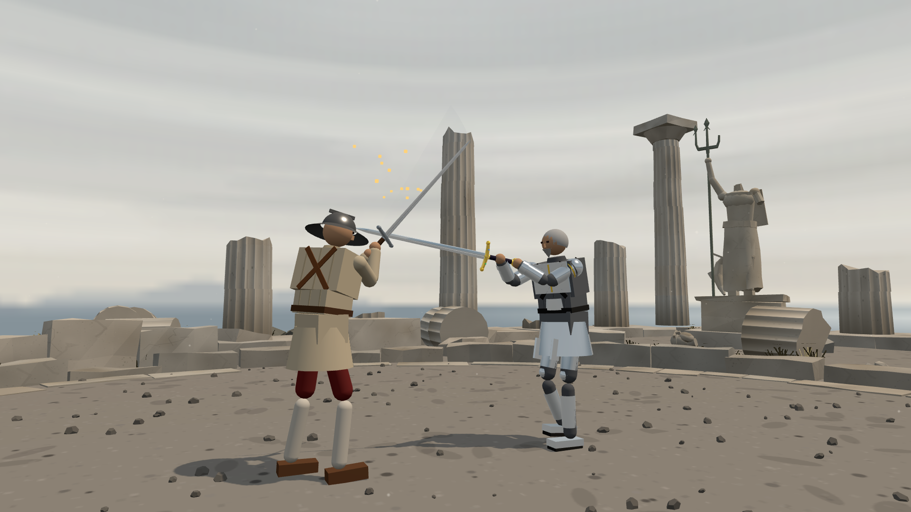
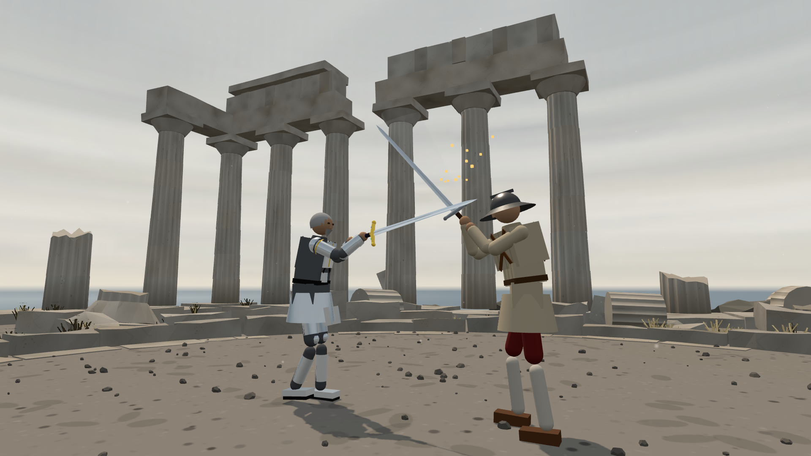
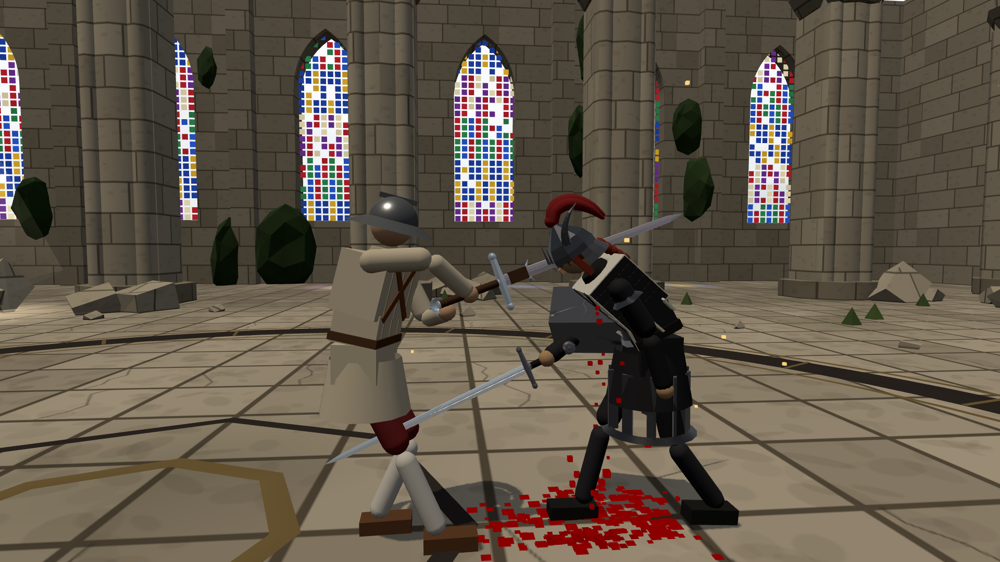
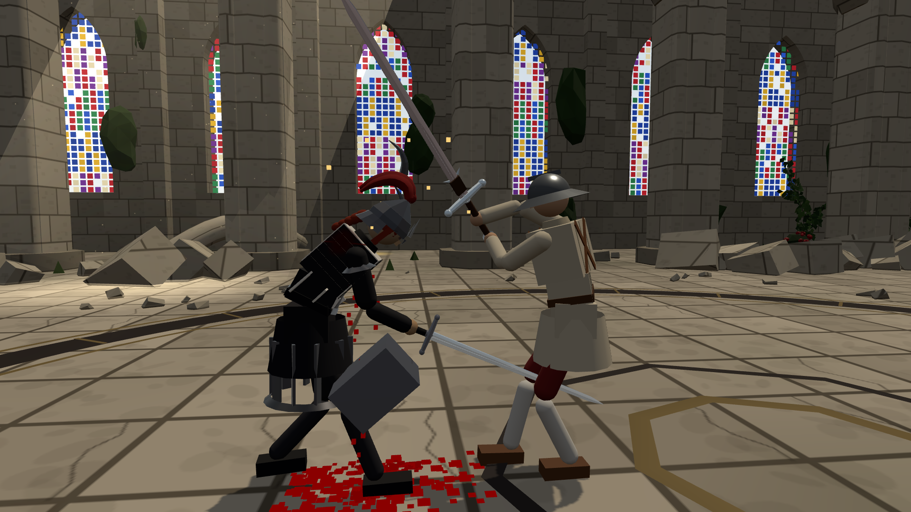

# 포세이돈 신전의 검 경합 · 2차 홍보 촬영

2026-10-02. 1920×1080 원본 스크린샷. 대사와 HUD를 숨기고 실제 전투를 일시정지한 뒤 카메라를 조정했다. 이미지 후처리·합성 효과는 없다.

## 하인리히와의 결투 · 포세이돈 석상 구도

삼지창을 든 석상과 두 검의 교차를 함께 담은 구도.

## 하인리히와의 결투 · 신전 기둥과 들보 구도

기둥 상부에 남은 들보까지 보이는 낮은 시점. 두 이미지는 같은 실제 검 충돌 직후의 서로 다른 카메라 시점이다.

기준 소스·게임 입력·장면 설정·카메라·충돌 기록·원본 해시는 [heinrich-provenance.json](heinrich-provenance.json)에 있다. 기존 AI로 두 캐릭터를 조작했고 물리·신체 위치·충돌 판정은 직접 수정하지 않았다. 게임의 연구 중인 기능 완성을 주장하는 검증 사진이 아니다.

## 슈바르츠 · 투구에 검이 맞는 순간

## 슈바르츠 · 투구 뿔이 떨어지고 금속 파편이 튀는 순간

위 두 장은 **재현용 손·이동 입력으로 실제 게임에서 촬영**했다. 공격자는 발로 접근하며 손 목표를 위아래로 움직이고, 슈바르츠는 낮은 손 목표와 중립 이동 입력을 유지했다. 몸 위치·속도·체력·방어구 내구도·충돌 판정에 직접 값을 넣지 않았다. 카메라와 대사/UI 표시만 촬영에 맞게 조정했다.

실제 기록: 투구 타격 **37.264J**, 내구 **1 → 0.686766**, 오른쪽 뿔 `hornR` 분리. 두 번째 사진은 반대쪽 시점에서 0.1417 게임초 뒤의 순간이며 양쪽 캐릭터가 생존해 있다. 근접 구도라 공격자의 긴 검 끝은 화면 상단 밖으로 일부 나간다. 투구 본체는 남아 있으며, 완전 파괴나 빗겨 맞는 각도를 검증한 사진으로 표기하지 않는다.

입력·카메라·이미지 해시는 [schwarz-provenance.json](schwarz-provenance.json), 정상 충돌의 이벤트는 [schwarz-helmet-events.json](schwarz-helmet-events.json)에 있다. 다른 2단계 파손 컷은 후속 브라우저 시계 오류로 대응 이벤트 기록이 저장되지 않아 최종 선택에 넣지 않았다. 이 사진들의 타격/파손 기록과 별개인 촬영 도구 오류다.
