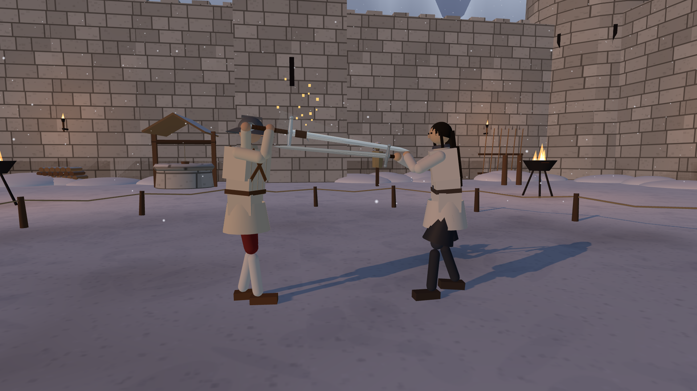
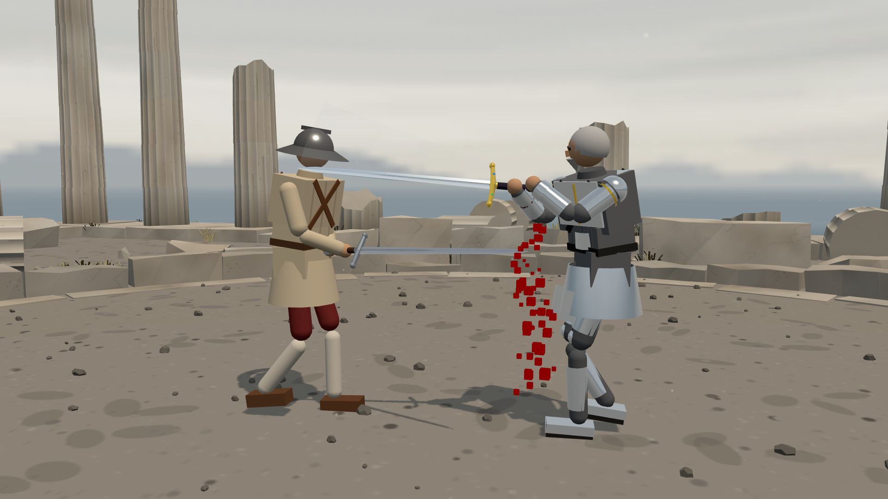
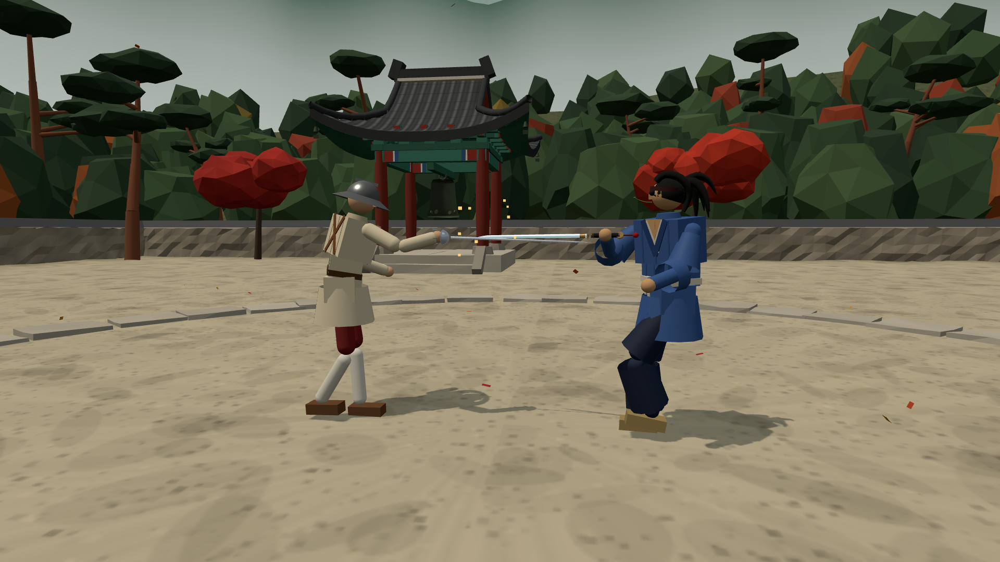
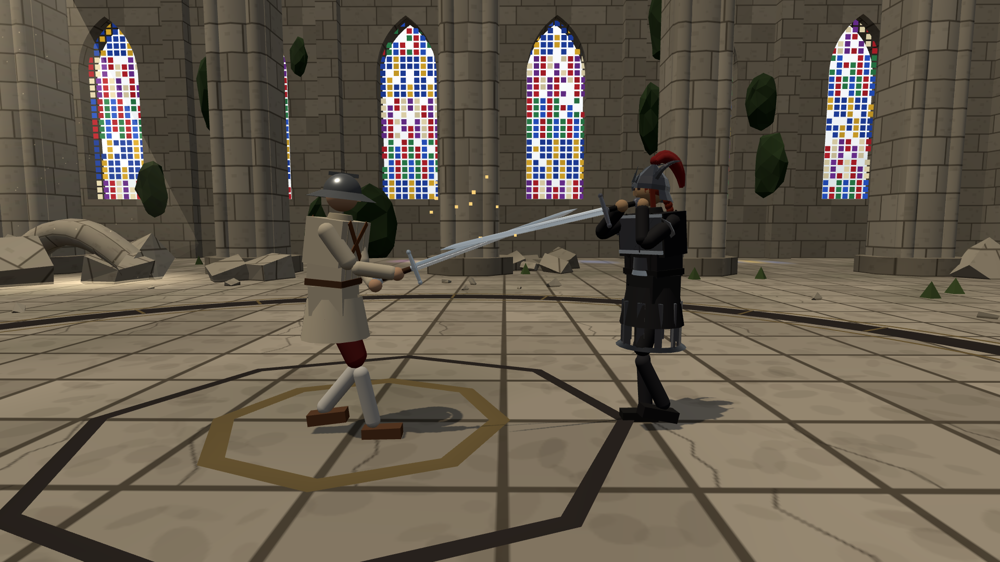
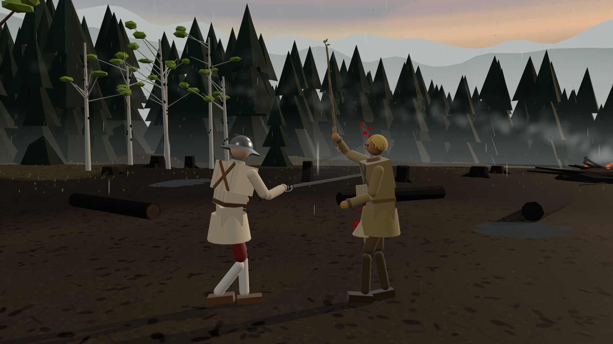
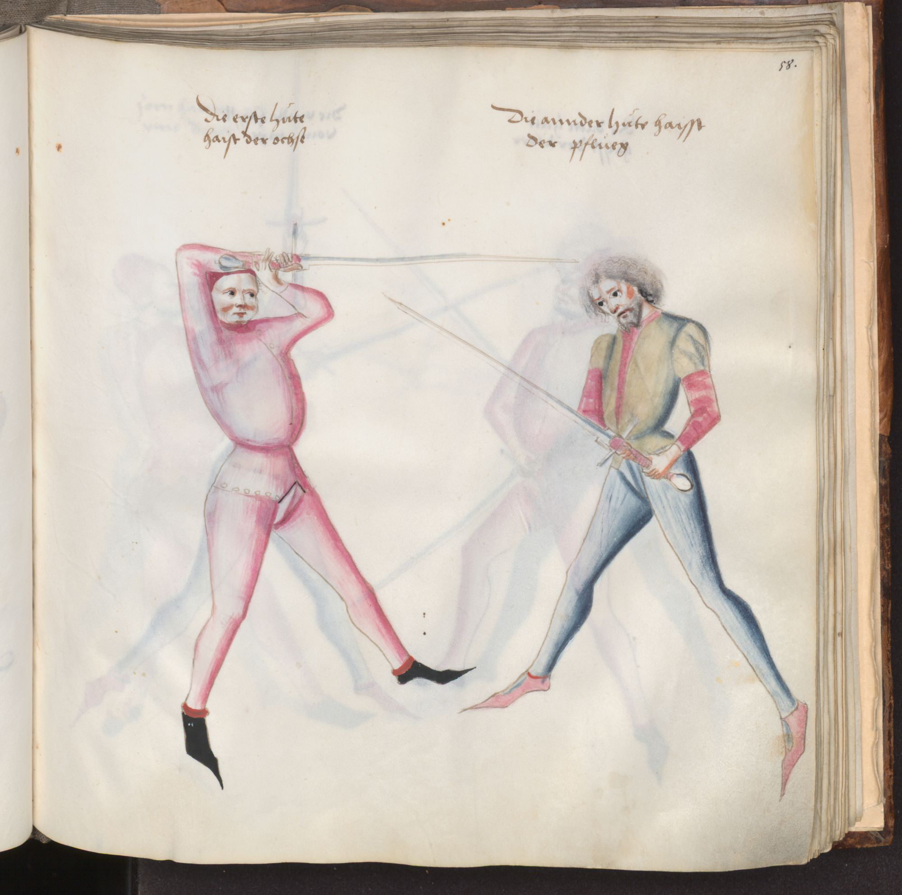
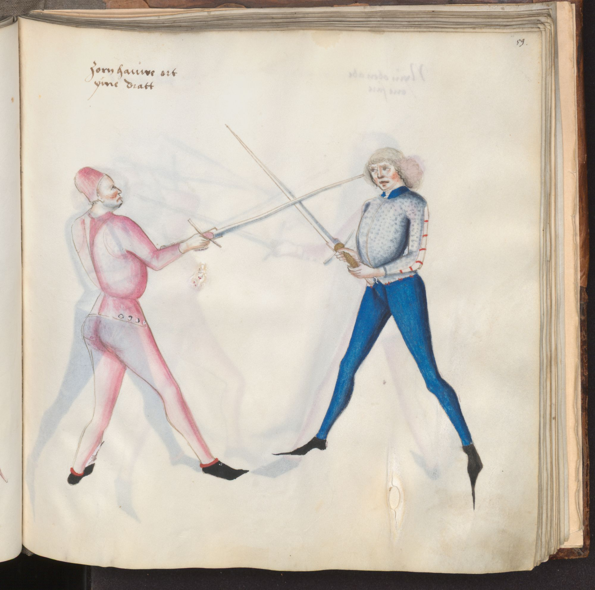

# 적막 홍보용 이미지 · 2026-10-02

대사와 HUD를 숨긴 **1920×1080 실제 게임 캡처 5장**과 리히테나워 전승 계열의 **검술서 삽화 2장**. 각 이미지를 열어 원본을 저장할 수 있다.

## 게임 스크린샷

게임 기준 커밋: `d0de72c326dd15118291ab37d039670397db49aa`.
기존 AI가 양쪽 캐릭터를 조작하는 실제 전투에서 촬영했다. 물리·충돌·신체 자세를 직접 수정하지 않았으며, 일시정지와 촬영용 카메라·UI 숨김만 사용했다. 합성 이미지·후처리·추가 효과는 없다. 캡처는 현 게임의 표현이며 진행 중인 전신 물리 연구의 완료 근거가 아니다.

### 양손 대검과 받아내기

### 베기와 출혈

### 레이피어와 청강검의 교전

### 성당에서 맞부딪친 검

### 빗속 숲의 근접전

설정·무기·촬영 시각·접촉 기록·파일 해시는 [capture-provenance.json](capture-provenance.json)에 보존했다. 다섯 장 모두 대사/UI와 인물·검의 화면 밖 잘림이 없음을 실제 이미지로 확인했다. 다섯 전투의 브라우저 pageerror는 0건이었다.

## 검술서 원본

**파울루스 칼(Paulus Kal), BSB Cgm 1507, 15세기 후반(늦어도 1479년).** 리히테나워 전승을 설명한 필사본이며 리히테나워의 친필 삽화책으로 표기하지 않는다. 바이에른 주립도서관 공식 스캔의 전체 페이지와 책 가장자리다. 공식 IIIF 서버의 폭 2000px JPEG를 변경 없이 보존했다.

### 58r · Ochs와 Pflug 자세

[도서관 원본 열람](https://www.digitale-sammlungen.de/en/view/bsb00001840?page=119)

### 59r · Zornhau-Ort

[도서관 원본 열람](https://www.digitale-sammlungen.de/en/view/bsb00001840?page=121)

공식 [IIIF manifest](https://api.digitale-sammlungen.de/iiif/presentation/v2/bsb00001840/manifest)는 [Public Domain Mark 1.0](https://creativecommons.org/publicdomain/mark/1.0/)을 표시한다. 상업 홍보에 재사용할 수 있는 공공영역 자료다. 원본 URL·권리 근거·해시는 [manuscript-provenance.json](manuscript-provenance.json)에 있다.

권장 출처 표기:

> 파울루스 칼, 《검술서》, BSB Cgm 1507, fol. 58r·59r, 15세기 후반(늦어도 1479년). Bayerische Staatsbibliothek, München. Public Domain.
